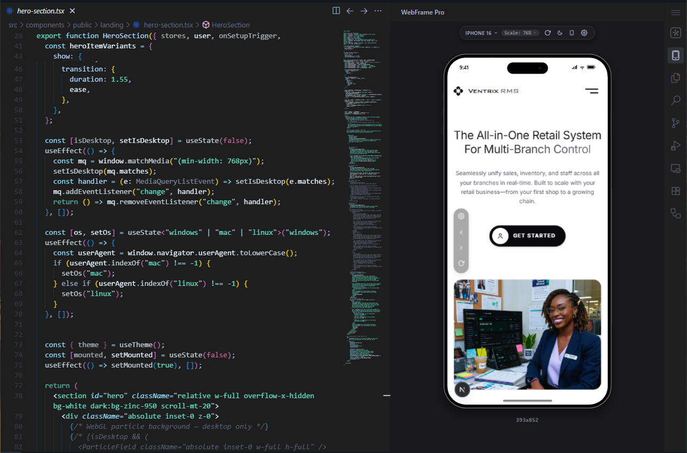

# WebFrame Pro

<!--
<p align="left">
  
</p>
-->

<p align="left">
  
</p>


<p align="left">
  <a href="https://marketplace.visualstudio.com/items?itemName=ChristliebDela.webframe-pro"></a>
  <a href="https://marketplace.visualstudio.com/items?itemName=ChristliebDela.webframe-pro"></a>
  <a href="https://open-vsx.org/extension/ChristliebDela/webframe-pro"></a>
  <a href="https://open-vsx.org/extension/ChristliebDela/webframe-pro"></a>
  <a href="https://github.com/christliebdela/webframe-pro/issues"></a>
  <a href="https://github.com/christliebdela/webframe-pro/pulls"></a>
  <a href="https://github.com/christliebdela/webframe-pro/blob/main/LICENSE"></a>
</p>

## The Pain Point

As a modern web developer building responsive or mobile-first web applications, testing layouts on mobile viewports is filled with friction:

1. **Heavy Emulators**: Launching official simulators (iOS Xcode Simulator or Android Studio Emulator) requires gigabytes of SDK downloads, consumes massive system memory, takes minutes to boot, and drains laptop batteries.
2. **Context Switching**: Browser Developer Tools are helpful, but require constant window toggling (`Alt+Tab`), separating your preview canvas from your editor.
3. **Lack of Hardware Realism**: Standard browser viewport resizers fail to replicate true hardware characteristics—like safe-area notch/Dynamic Island offsets, physical aspect ratios, system status bars, and home gesture indicators.
4. **Proxy & Frame Blockers**: Directly iframe-embedding local servers often fails due to strict CORS boundaries, Content Security Policies (CSP), missing history navigation, and cookies/sessions getting lost on every reload or panel toggle.

---

## The Solution: WebFrame Pro

**WebFrame Pro** brings pixel-perfect, high-fidelity physical device previews directly inside your IDE workspace. 

By utilizing a lightweight local HTTP reverse proxy and an elegant vector-frame system, WebFrame Pro lets you preview your live web application inside true-to-life hardware mockups (e.g. iPhone 16 Pro, Google Pixel 9, iPad) with zero emulator overhead, instant startups, and complete session persistence.

---

## Key Features

- **Fidelity Vector Mockups**: Renders web applications inside detailed device frames containing accurate status bars, home indicators, camera punch holes, and curved display edges.
- **Auto-Discovery of Local Servers**: Scans active development ports (Vite, Next.js, Webpack, Nuxt, etc. on ports 3000, 3001, 5173, 8080, etc.) automatically and lists active local servers for one-click previews.
- **Persistent Session Proxying**: Proxies traffic through a sandboxed local server that intercepts and rewrites cookies, allowing login credentials and authentication states to persist across extension reloads.
- **Frosted Assistive Controls**: A dark-frosted floating control panel overlay inside the iframe that snaps to viewport edges, providing Back, Forward, and Page Reload actions while avoiding iframe history-trapping.
- **Auto-Rotating layouts**: Instantly rotate between Portrait and Landscape orientations. Bezels, status bar texts, and home gesture overlays rotate dynamically.
- **Dynamic Workbench Scaling**: Zoom mockups to 50%, 75%, 100%, or select **Fit** mode to scale the entire device layout fluidly with your editor panel width.
- **SPA & HMR-Resilient**: Integrated DOM observers automatically re-append preview UI elements even during aggressive Hot Module Replacements (HMR) or React/Next client-side hydration transitions.

---

## Supported Devices

| Category | Device Model | Key Hardware Features | Aspect Ratio |
| :--- | :--- | :--- | :--- |
| **iOS / Apple** | **iPhone 16 Pro** | Dynamic Island, ultra-thin borders, safe-area insets | 19.5:9 |
| | **iPhone 16** | Dynamic Island, standard bezels | 19.5:9 |
| | **iPhone 12 Pro** | Classic camera notch | 19.5:9 |
| | **iPhone 11** | Standard liquid-retina bezel, wide notch | 19.5:9 |
| | **iPhone SE** | Home button, classic top/bottom header bars | 16:9 |
| | **iPad Pro** | Symmetric tablet bezels, large canvas | 4:3 |
| | **iPad Air** | Standard tablet bezels | 4:3 |
| | **iPad Mini** | Compact tablet display | 4:3 |
| **Android / Google** | **Google Pixel 9** | Center circular punch-hole camera | 19.5:9 |
| | **Google Pixel Fold** | Inner folding display with subtle crease overlay | 6:5 |
| **Android / Samsung** | **Samsung S25 Ultra** | Sharp titanium squared corners, punch-hole | 19.5:9 |
| | **Samsung S20 Ultra** | Soft rounded corners, punch-hole | 20:9 |
| | **Samsung Galaxy A55** | Mid-range bezel body, punch-hole | 19.5:9 |
| **Smart Hubs & Screens**| **Microsoft Surface 7** | Thick hybrid computing bezels | 3:2 |
| | **Google Nest Hub** | Desktop smart hub stand with frame bezels | 16:9 |

---

## Installation

WebFrame Pro is fully compatible with VS Code, Antigravity, VSCodium, Eclipse Theia, and any other IDE supporting VS Code extensions.

1. Open your IDE's Extensions panel (`Ctrl+Shift+X` or `Cmd+Shift+X`).
2. Search for `"WebFrame Pro"`.
3. Click **Install**.

---

## How to Use

### 1. Launching the Preview
- Click the **WebFrame Pro** icon in your IDE's Activity Bar.
- The preview workbench launches automatically inside the side panel or editor view, scans for running development servers, and immediately renders the device viewport!
- If multiple local servers are running, choose your active port or input a public live URL from the toolbar's configuration settings.

### 2. Mockup Controls & Tool Bar
The top workbench control bar lets you customize your preview:
- **Device Selector**: Swap the physical hardware mockup instantly.
- **Scale Menu**: Zoom the device frame. Select **Fit** to make the device scale dynamically as you split or resize your editor pane.
- **Refresh Trigger**: Manually reload the active web frame.
- **Dark/Light Mode**: Toggle the status bar and browser canvas color scheme.
- **Orientation Toggle**: Rotate the phone between Portrait and Landscape layout.

### 3. Assistive Navigation Panel
Inside the preview mockup, you will see a subtle, floating cog icon at the middle-left of the screen:
- **Repositioning**: Click and drag the cog to move the panel vertically. Upon release, it automatically snaps to the closest horizontal screen edge (left or right) to avoid blocking content.
- **Expanding**: Click the cog to grow the pill vertically, revealing **Go Back (←)**, **Go Forward (→)**, and **Reload (⟳)** buttons.
- **Frosted Glass Design**: Dark semi-transparent frosted styling ensures high contrast and visibility on both dark and light web pages.

---

## Under The Hood

To bypass iframe security sandboxes and keep your local dev environment running cleanly, WebFrame Pro implements a lightweight proxy architecture:

```
[ IDE Preview Tab ] <---> [ Local HTTP Reverse Proxy ] <---> [ Your Local Dev Server ]
        |                              |
 (Injected Script)            (Cookie & Header Rewriting)
        |                              |
 [ Navigation Controls ]         [ Auth Cookies Persisted ]
```

1. **Reverse Proxying**: The extension runs a sandboxed local proxy server. When it loads your local web application, it rewrites request and response headers (stripping strict CSP frame block headers and modifying `set-cookie` domains).
2. **Session Persistence**: Login cookies are stored and re-mapped dynamically, meaning you stay signed in even when swapping mockups or reloading the extension.
3. **Script Injection**: A custom runtime script is injected into the HTML document. This script sets up a communication bridge to listen to history nav triggers, and runs a `MutationObserver` on the body to keep the Assistive Touch panel alive during client-side hydration or HMR.

---

## Development

### Prerequisites
- Node.js (version 18 or above)
- VS Code (version 1.90.0 or above)

### Setup & Compilation
1. Clone the repository.
2. Install project dependencies:
   ```bash
   npm install
   ```
3. Compile TypeScript sources:
   ```bash
   npm run compile
   ```
4. Press `F5` to launch the **Extension Development Host** to test your changes.

---

## Check Out My Other Extensions

If you like WebFrame Pro, check out:
- **[Comment Cleaner Pro](https://marketplace.visualstudio.com/items?itemName=ChristliebDela.comment-cleaner-pro)** - A high-performance extension powered by a Python engine to instantly find, analyze, and remove comments from your code across 33+ programming languages.

---

## License

This project is licensed under the GPL-3.0 License.

---

## Author

<div align="left">
  <a href="https://github.com/christliebdela">
    
  </a>
  <p>Thank you for using WebFrame Pro!</p>
</div>
